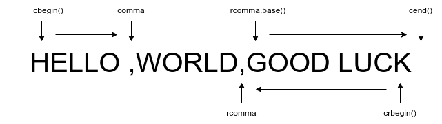

## 第10章

## 前言

在前面我们学习容器的时候，是否发现标准库下的对容器的操作并不是太多（或许，初学时已经觉得好多了😅），其实C++将大量的功能操作集成在泛型算法中。泛型（generic），即通用，意为其独立于任何特定的容器，操作于不同类型的容器和不同类型的元素。
回想一下，在学习顺序容器的过程中，我们学习了哪些容器操作？

添加、删除容器元素；容器是否为空；获取容器元素的迭代器；访问首尾元素；

以上的操作仅仅只是对容器的基础操作，我们并不满足。有时候我们希望能够对容器进行排序、搜索、替换等等操作。如果对每个特定的容器都设置对应的操作算法，这显然会使得对容器的操作变得复杂、杂乱。所以，这就是为什么容器仅提供少量的操作，因为标准库将大量的操作进行集合，形成泛型算法。

---

## 10.1 概述

大多数的算法都定义在`algorithm`中，其中在`numeric`头文件中定义了一组数值泛型算法。

算法是如何独立于特定的容器的呢？回想一下，每个容器都存在迭代器，通过迭代器我们可以自由访问、操作容器。所以，实际上算法并不会直接操作容器，而是通过迭代器
**间接**操作容器。

例如，find算法（用于查找某项值），其算法便是通过迭代器指定一个元素范围，通过**遍历**范围进行查找。

```cpp
#include <iostream>
#include <vector>
#include <algorithm>

int main(){
    std::vector<int> vector{1,2,3,4,5,6,7};
    int value=2;
    auto result=std::find(vector.cbegin(),vector.cend(),value);
    std::cout   << "The result "<< value <<" "
                << (result==vector.cend()? "does not exist in this vector":"does exist in this vector")
                << std::endl;
}
```

从上例中，我们可以看出，find算法是直接操作迭代器，所以除了可以使用find算法查找vector中元素，我们还可以查找string中的元素，甚至是内置数组中元素。

```cpp
// find character
std::string str("hi good morning!");
char value('h');
auto result=std::find(str.cbegin(),str.cend(),value);

// find number
int assemble[]={1,2,3,4,5,6,7};
int value=3;
int *result=std::find(std::begin(assemble),std::end(assemble),value);
```

### find算法的工作原理

1. 访问序列中的首元素
2. 比较此元素与目标元素
3. 与目标元素匹配，返回标识此元素的值
4. 若没有匹配，find查找下一个元素，重复步骤2和3
5. 若到达序列尾，find停止
6. 若到达序列尾，依旧没有找到目标元素，返回指出元素未找到的值。且此值和步骤3中返回值具有相容类型

从上面步骤我们可以看出，find算法在所有步骤上都**不依赖**容器中所保存的元素类型。因此，只要通过迭代器访问元素，find算法就完全不依赖容器类型，甚至无需理会其是否是不是容器。

但是，虽然通过迭代器算法不依赖于容器，但是算法**依赖于元素类型的操作
**。这听起来挺奇怪的，为什么呢？正像上面例子一样，`result==vector.cend()`，find算法在实际运行中，使用`==`运算符对元素进行判断。类似于find，大多数算法都会使用到一个（或者多个）元素类型的操作，所以算法依赖于元素类型的操作，但并不依赖于容器。

### 算法永远不会执行容器操作

**泛型算法本身不会执行容器的操作，它们指挥运行于迭代器之上，执行迭代器的操作**。

正因为如此，算法永远不会改变底层容器的大小，算法可以删除、添加、移动容器中的元素，但其都是基于迭代器实现，算法本身并不会做出这样的操作。

## 10.2 初识泛型算法

在标准库中存在100余种算法，想要通过死记的方式显然是困难的。但是这些算法都具有一致的结构（也就是统一原则），通过理解此结构无疑是事半功倍。

大多数的标准库算法都是对一个范围的元素（即“输入范围”）进行操作。如前面所学的find算法，接受输入范围的算法总是通过前两个参数（一般是两个表示指向范围边界元素的迭代器）表示此范围。

大多数标准库算法对输入范围的遍历类似（一般结构），只不过对范围内的元素操作不同。

### 只读算法

如其名，某些算法仅读取输入范围中的元素，并不会改变元素，则成为只读算法。如我们在前面所学到的find和count算法。下面我们继续学习两个只读算法：用于求和的accumulate算法和用于比较两序列的equal算法。

#### accumulate算法

该算法定义在`numeric`头文件中。其接受三个参数，前两个参数确定输入范围，第三个参数作为和的初值。第三个参数类型*
*决定函数该使用哪种加法运算符以及返回值类型**。

```cpp
#include <iostream>
#include <vector>
#include <algorithm>
#include <string>
#include <numeric>

int main(){
    std::vector<int> assemble{1,2,3,4,5,6,7};
    int sum=std::accumulate(assemble.cbegin(),assemble.cend(),0);
    std::cout << "the sum for assemble is :"<<sum << std::endl;
}
```

accumulate算法中第三个参数作为求和起点，正如上面所描述的代码，其蕴含一个编程**假设
**：该第三参数类型必须能够与输入范围内元素相加，也就是必须能与之匹配（或者转换）。如：输入范围内元素类型为int，那么第三参数类型可以为double、long long等等。

另外一个例子：

```cpp
#include <iostream>
#include <vector>
#include <algorithm>
#include <string>
#include <numeric>

int main(){
    std::vector<std::string> assemble{"hello ","world! ","welcome ","to ","new ","home!"};
    std::string sum=std::accumulate(assemble.cbegin(),assemble.cend(),std::string(""));
    std::cout << "the sum for assemble is :"<<sum << std::endl;
}
```

第三参数定义为`string("")`，那么其实就告诉accumulate算法我的初值是string类型的空串，我要将vector中string类型元素加起来，并且返回为string。

那么为什么第三参数不直接写成`""`，首先在学习string时我们知道`""`是一个字符串字面值，其不能作为第一参数与其他string类型的字符串相加。因为字符串字面值其类型为`const char*`，该类型并没有“+”运算符，怎么能够相加呢？（但是我们可以这样`string+const char*`，这是为C做出的妥协）

#### equal算法

equal，译为平等。该算法作用为比较两个序列是否相等。同样该算法具有三个参数，前两个参数用于确定第一个序列的输入范围，第三个参数则用于确定第二个序列的首元素。

这里同样存在一个隐含编程假设：那就是**假设第二序列的长度至少和第一序列长度一样长**，或者更长，因为equal算法仅确定第二序列的首元素，并没有确定其尾元素。

```cpp
#include <iostream>
#include <vector>
#include <algorithm>
#include <string>

int main(){
    std::vector<int> vector_1{1,2,3};
    std::vector<int> vector_2{1,2,3};
    bool result=std::equal(vector_1.cbegin(),vector_1.cend(),vector_2.cbegin());
    std::cout << (result==true?"there two vector is equal":"there two vector isn't equal") << std::endl;
}
```

> 迭代器参数
>
> 1. 算法仅要求能够比较两个序列中的元素，并不会对序列属于那种类型做出要求，同时也不会严格要求两比较序列中元素相同。
> 2. 在操作两个序列的算法中，如果某些算法仅接受三个迭代器，那么默认前两个参数确定第一序列的元素范围，第三个参数确定第二个序列中的首元素。如果接受四个迭代器，则前两个参数确定第一个序列元素范围，后两个参数确定第二个序列的元素范围。
> 3. 仅接受单一迭代器表示第二个序列的算法都**假定**第二个序列至少和第一个序列一样长，算法并不做出保证（这是程序员的责任）。

一个很有趣的现象是在完成10.5练习题时，会发现equal算法其实对“==”运算符做了重载，所以无论是对string还是C风格字符串进行比较都是可行的。

在早些版本的标准库中，equal算法并不能对C风格字符串中元素进行比较，其比较的是指针位置。

### 写容器元素的算法

一些算法会将新值赋予序列中的元素（注意：不是改变容器的大小，所以赋予新值数目必定会比原容器中元素数目小，或者相等）。

这些算法本质上仅仅改变容器中已存在的元素，不会越界所以并不危险。

例如，fill（填满）算法就是将第三参数替换输入范围内所有元素。

```cpp
#include <vector>
#include <list>
#include <string>
#include <iostream>

int main(){
    std::vector<int> vector{1,2,3,4,5,6,7};
    std::fill(vector.begin(),vector.end(),0);
    for(auto const &c:vector)
        std::cout << c << " ";
}
```

#### 算法不检查写操作

如标题所言，算法在执行过程中都会假定参数是正确的，例如：fill_n算法（其接受一个目的位置，并向该序列中赋予指定数目的新值）。

```cpp
#include <vector>
#include <list>
#include <string>
#include <iostream>

int main(){
    std::vector<int> vector(10);
    // 向vector序列中赋予10个1
    std::fill_n(vector.begin(),10,1);
    for(auto const &c:vector)
        std::cout << c << " ";
}
```

在上面的代码中，我们写明了vector容器中含有10个元素，但是假如我们将vector设置为空呢：

```bash
 './main' terminated by signal SIGSEGV (Address boundary error)
```

g++给出如上的提示，告诉我们越界了，说明fill_n算法执行（同样说明算法并不会检查写操作）。

#### 介绍back_inserter

在前面我们学习的迭代器都是为了指向一个确切元素，但是显然在某些情况下并不能满足实际需求，这个时候我们就需要使用到
**插入迭代器**（insert_iterator）。插入迭代器的目的就是向容器中添加元素。

使用插入迭代器，我们需要通过**back_inserter**函数，其定义在iterator文件中。

back_inserter接受一个指向容器的引用，返回一个与该容器绑定的插入迭代器。当向此迭代器赋值时，赋值运算符会调用push_back将一个具有个顶值的元素添加到容器中。

```cpp
#include <vector>
#include <iostream>
#include <iterator>

int main(){
    std::vector<int> vector;
    auto insert_iterator=std::back_inserter(vector);
    insert_iterator=12;
    for(auto const &c:vector)
        std::cout << c << " ";
}
```

回到我们所讨论的fill_n算法，由于无法通过`vec.begin()`作为目的位置为空容器进行写操作，那么这个时候我们就需要通过back_inserter函数来创建一个迭代器，作为算法的目的位置使用。

```cpp
#include <vector>
#include <iostream>
#include <iterator>

int main(){
    std::vector<int> vector;
    std::fill_n(back_inserter(vector),10,1);
    for(auto const &c:vector)
        std::cout << c << " ";
}
```

每次迭代，back_inserter返回的插入迭代器都会调用push_back成员在容器末尾添加指定函数。

#### 拷贝算法

拷贝（copy）算法作用便是向另一个指定目的位置的迭代器所指向输出序列中的元素中写入数据。

该算法接受三个迭代器，所以隐含被拷贝对象的长度至少比输入序列的长度长，或者相等。

```cpp
#include <iostream>

#include <vector>
#include <list>


int main(){
    std::vector<int> vector{1,2,3,4,5};
    std::list<int> list{0,9,8,7,6,5};

    auto post_tail=copy(vector.cbegin(),vector.cend(),list.begin());
    for(auto const &c:list)
        std::cout << c << " ";
}
```

copy算法返回其目的位置迭代器的值（当然，这个值是经过递增后的），即list的尾后迭代器。

在有些算法中，其“拷贝”版本，并不会将其放在输入序列的末尾，而是创建一个新序列保存。

如，replace算法，其本身是替换序列中元素。

```cpp
replace(vector.begin(),vector.end(),0,1);
```

将vector容器中所有值为0的元素替换为1

如果我们希望原序列不变，那么我们可以使用replace_copy算法。

```cpp
replace_copy(vector.cbegin(),vector.cend(),back_inserter(list),0,1)
```

通过`back_inserter`创建一个新序列，其原序列vector不变，拷贝一份vector中元素于list中，且其中值为0的元素被替换为1。

### 重排容器元素的算法

sort算法，其通过利用元素类型的<运算符实现排序。

unique算法，覆盖重复元素。

## 10.3 定制操作

在前面我们学到的算法大多使用到了元素类型的<或者=运算符进行元素比较。但是有些时候，我们希望自定义运算符，例如：当我们对未定义<运算符的元素类型进行比较。

### 向算法传递函数

**谓词**(predicate)

谓词是一个可调用的表达式，其返回结果是一个能用作条件的值。

标准库算法所使用的谓词分为两类：**一元谓词**(unary predicate) 和**二元谓词**(binary predicate)。

- 一元谓词：意味着它们是接受单一参数
- 二元谓词：意味着它们有两个参数

接受谓词参数的算法对输入序列中的元素调用谓词，因此，元素类型必须能够转换为谓词的参数类型。

### lambda表达式

> 使用场景
>
> 对于那种只在一两个地方使用的简单操作，lambda表达式是最有用的。

无论是一元还是二元谓词，我们传递必须严格执行接受参数的数目，显然，在某些情况下这受到了限制。

例如，我们有一种需求：求大于等于一个给定的单词，打印符合要求的单词。

> 从要求，我们可以使用标准库中的find_if算法查找第一个具有特定大小的元素，接下来只需要设定好要求即可。但是如果我们使用谓词作为find_if算法的第三个参数，显然无法满足需求（因为需要对单词进行判断）。

这个时候，我们就需要使用lambda表达式！

在前面我们学过两种可调用对象：函数与函数指针，除此还有：重载了函数调用运算符的类与lambda表达式。

一个lambda表达式表示一个可调用的代码单元，可理解为内联函数。

> 一般的lambda表达式具有一个返回类型、一个参数列表和一个函数体
>
> 一般结构：
>
> [capture list\](parameter list)-> return type{function body}
>
> 示例：
> ```cpp
>   int  a = 10, b = 20;
>   auto c = [a, b](const int &c) -> int { return a + b + c; };
>   std::cout << "a + b + c = " << c(30) << "\n";
> ```
>
> 需要注意的是：
>   1. lambda必须使用尾置返回来指定返回类型
>   2. lambda可以忽略参数列表与返回类型，但是必须包含捕获列表和函数体
>   3. 如果忽略返回类型，那么lambda根据函数体中代码推断返回类型(默认为void)
>   4. lambda不能存在默认参数
>   5. 捕获列表只用于局部非static变量，lambda可以直接使用局部static变量和在它所在函数之外声明的名字

### lambda捕获和返回

当定义一个lambda时，编译器会生成一个与lambda对应的新的类类型。

所以，当lambda表达式捕获变量时，由此生成的类类型中也会包含对应于捕获变量的数据成员，且lambda的数据成员会随着lambda对象的创建时被初始化。

类似参数传递，变量的捕获也可以是值或者引用。

#### 值捕获

> 采用值捕获的前提是变量可以拷贝

与参数值传递不同的是，被捕获的变量的值是在lambda创建时拷贝，而不是在调用时拷贝。

```cpp
void function_1{
	size_t value=42;
    auto f=[value]{return value;}; // 将value拷贝到f可调用对象中
    value=0;
    auto j=f(); // j仍然为42，f保存了我们在创建它时value的拷贝
}
```

#### 引用捕获

当某些情况下，我们不能够拷贝捕获变量（如IO对象），那么我们就必须使用引用捕获。

与参数引用类似，

``````cpp
void function_2{
    size_t value=42;
    auto f=[&value]{return value;}; // 将value拷贝到f可调用对象中
    value=0;
    auto j=f(); // j仍然为0，f保存了value的引用，而非拷贝
};
``````

> 引用捕获和返回引用都有着相同的问题和限制。
>
> 如果采用引用方式捕获一个变量，就必须确保被引用对象在lambda执行的时候是存在的。

> 建议
>
> 尽量保持lambda的变量捕获简单化
>
> 一般来说，我们应该尽量减少捕获的数据量来避免潜在的捕获导致的问题。如果可能的话，应该避免捕获指针或引用。

#### 隐式捕获

编译器可以根据lambda体中的代码推断我们要使用哪些变量😊。为了指示编译器推断捕获列表，应该在捕获列表中写入&或者=，以表示编译器应该采用哪种捕获方式

例如：

``````cpp
// 隐式捕获
int sz=10;
auto a=[=](const string&s){return s.size()>=sz};
``````

我们还不满足，希望对一部分变来能够采用值捕获，对另外一部分采用引用捕获，可以混合显式与隐式捕获。

那么我们需要：

1. 捕获列表中的第一个元素必须是&或者=，以此指定默认捕获方式为引用还是值。
2. 显示捕获的变量必须使用与隐式捕获不同的方式。

例如：

```cpp
int a=10,b=20;
/* a为隐式捕获，引用捕获方式；b为显式捕获，值捕获方式 */
auto c=[&,b](const string&s){return s.size>=a+b;};
/* a为显式捕获，引用捕获方式；b为隐式捕获，值捕获方式 */
auto c=[=,&a](const string&s){return s.size>=a+b;};
```

综上所述，lambda捕获有一下方式：

|         lambda捕获列表         |                                                          解释                                                          |
|:--------------------------:|:--------------------------------------------------------------------------------------------------------------------:|
|             []             |                                    空捕获列表。lambda不能使用所在函数中的变量。一个lambda只有捕获变量后才能使用它们                                    |
|       [<i>names</i>]       |              <i>names</i>是一个逗号分隔的名字列表，这些名字都是lambda所在函数的局部变量。默认情况下，捕获列表中的变量**都被拷贝**。名字前如果使用了&，则采用引用捕获方式               |
|             &              |                                    隐式捕获列表，采用引用捕获方式。lambda体中所使用的来自所在函数的实体都采用引用方式使用                                    |
|            [=]             |                                       隐式捕获列表，采用值捕获方式。lambda体将拷贝所使用的来所在函数的实体的值                                        |
| [&,<i>identifier_list</i>] | <i>identifier_list</i>是一个逗号分隔的列表，包含0个或多个来自所在函数的变量。这些变量采用值捕获的方式，而任何隐式捕获的变量都采用引用方式捕获。<i>identifier_list</i>中的名字前面不能使用& |
| [=,<i>identifier_list</i>] |      <i>identifier_list</i>中的变量都采用引用方式捕获，而任何隐式捕获的变量都采用值方式捕获。<i>identifier_list</i>中的名字**不能包括this**,且这些名字之前必须使用&      |

#### 可变lambda

默认情况下，对于一个被值捕获的变量，是不会被修改的。但是如果希望修改，则需要在参数列表尾加上关键字mutable。

例如：

```cpp
size_t v1=42;
auto f=[v1]()mutable{return ++v1;};
v1=0;
auto j=f();
std::cout << j << std::endl;
return 0;
```

对于引用捕获的变量是否可以修改依赖于此引用指向的是一个const类型还是非const类型。

例如：

```cpp
size_t v1=42;
auto f=[&v1]{return ++v1;};
v1=0;
auto j=f(); // j为1
```

#### 指定lambda返回类型

> 默认情况下，**如果一个lambda体包含return之外的任何语句，则编译器假定此lambda返回void
**。与其他返回void的函数类似，被推断返回void的lambda不能返回值。

所以，如果lambda体含有多行表达式，则必须使用尾置返回类型确定返回类型。

例如：

```cpp
/* 将v1中每个负数替换为其绝对值 */
// transform算法将一个序列中元素进行替换。
transform(v1.begin(),v1.end(),v1.begin,
		[](int i){return i<0?-i:i;}); // true
transform(v1.begin(),v1.end(),v1.begin,
		[](int i){if (i<0) return -i; else return i;); // false
```

在第二个transform算法中，由于lambda表达式返回为void，但是其本应该返回int值。所以编译器编译错误。

修改为：

```cpp
transform(v1.begin(),v1.end(),v1.begin,
		[](int i) -> int {if (i<0) return -i; else return i;); 
```

### 参数绑定

为了解决某个函数中调用对象（如函数）必须接受单一参数问题，标准库定义bind函数（定义在functional头文件中）来解决该问题。

可以将bind看作一个通用的函数适配器，它接受一个可调用对象，生成一个新可调用对象来“适应”原对象的参数列表。

一般形式：

```cpp
auto newCallable=bind(callable,arg_list);
```

<i>arg_list</i>表示一个含有逗号隔离的参数列表，对应给定的callable的参数。在arg_list中可能包含形如“_n”，其中n是一个整数。这些参数称为“占位符”，用于表示newCallable的参数，其占据传递给newCallable的参数的“位置”。

例如：

```cpp
// check6是一个可调用对象，接受一个string类型的参数
auto check6=bind(check_size,_1,6);
```

_1出现在arg_list的第一个位置，表示check6的此参数对应check_size的第一个参数。加入该参数是一个const string&。那么，调用check6时必须传递给它一个string类型的参数。

完整代码：

```cpp
#include <iostream>
#include <functional>

bool check_size(const std::string& s,size_t size){
    return s.size()>size;
}
int main () {
    std::string str("hello world!");
    auto check6=std::bind(check_size,std::placeholders::_1,6);
    std::cout << "The size of str is greater than 6 ? "<<(check6(str)?"yes":"no") << std::endl;
}
```

在完整代码中，我们注意到在“_1”前增加了命名空间“placeholders”。这个命名空间本身定义在std命名空间中。名字_n都定义在上述的命名空间中。

在实际开发过程中，每次都书写声明占位符很麻烦，这个时候我们可以运用到using声明：

`using namespace namespace_name;`

bind除了可以修正参数外，还可以对可调用对象中的参数进行排序。

```cpp
// 存在g可调用对象，其存在5个参数
auto g=bind(f,a,b,_2,c,_1);
// 调用g，实际上映射到bind上为：bind(f,a,b,Y,c,X);
g(X,Y);
```

实例：

```cpp
// 按照单词长度升序
sort(words.begin(),words.end(),isShorter);
// 按照单词长度降序
sort(words.begin(),words.end(),bind(isShorter,_2,_1));
```

如果我们希望绑定的参数以引用方式传递，或者希望被绑定的参数为const，那么需要用到标准库中的ref和cref函数。（两函数均定义在functional头文件中）

- ref函数：返回一个对象，包含给定的引用，此对象是可以拷贝的
- cref函数：生成一个保存const引用的类

实例：

```cpp
ostream &print(ostream &os,const string &s,char c){
	return os<<s<<c;
}

for_each(words.begin(),words.end(),bind(print,ref(os),_1,' '));
```

## 10.4 再探迭代器

- 插入迭代器
  > 绑定到一个容器上，向容器插入元素
- 流迭代器
  > 绑定到输入输出流上，可用来遍历所有关联的IO流
- 反向迭代器
  > 迭代器向后移动，除了forward_list之外的容器均有反向迭代器
- 移动迭代器
  > 专用迭代器，不是拷贝元素而是移动元素

### 插入迭代器

插入器（插入迭代器）是一种**迭代器适配器**，其接受一个容器，生成一个迭代器，实现向给定容器添加元素。

> 通过插入迭代器进行赋值时，迭代器**调用容器操作**向给定容器的指定位置插入元素。

|    插入迭代器操作    |                                                         解释                                                          |
|:-------------:|:-------------------------------------------------------------------------------------------------------------------:|
|     it=t      | 在it指定的当前位置插入值t。假设c是it绑定的容器，依赖于插入迭代器的不同种类，才赋值会分别调用c.push_back(t)、c.push_front(t)或c.insert(t,p)，其中p为传递给inserter的迭代器位置 |
| *it,++it,it++ |                                                  不会对it做任何事情，均返回it                                                   |

插入器有三种：

- back_inserter
	- 创建一个使用push_back的迭代器
- front_inserter
	- 创建一个使用push_front的迭代器
	- 元素总是插入到容器第一个元素之前
- inserter
	- 创建一个使用insert的迭代器。函数接受第二参数，其参数必须是一个指向给定容器的迭代器。元素将被插入到给定迭代器所表示的元素
	  **之前**

示例：

```c++
#include <iostream>
#include <list>

int main(){
    std::list<int> list_1={1,2,3,4};
    std::list<int> list_2,list_3;
    std::copy(list_1.cbegin(),list_1.cend(),std::front_inserter(list_2));
    std::copy(list_1.cbegin(),list_1.cend(),std::inserter(list_3,list_3.begin()));

    // 4 3 2 1 
    for(auto const& var : list_2) {
        std::cout << var<<" ";
    }
    std::cout << std::endl;
    // 1 2 3 4
    for(auto const& var : list_3) {
        std::cout << var << " ";
    }
}
```

### iostream迭代器

> iostream迭代器将流当作一个特定类型的**元素序列**来处理。

- istream_iterator
  > 读取输入流
- ostream_iterator
  > 向一个输出流写数据

#### istream_iterator操作

创建一个流迭代器时，**必须指定迭代器将要读写的对象类型
**。同时由于istream_iterator使用>>来读取流，所以，istream_iterator所读取的类型必须定义了输入运算符。

示例：

1、

```cpp
// 绑定到流上
istream_iterator<int> int_it(cin);
// 默认初始化，创建可以当作尾后值使用的迭代器
istream_iterator<int> int_eof;
// 从“abc”中读取字符串
ifstream in("abc");
istream_iterator<string> str_it(in);
```

2、

```cpp
// main.cpp
#include <iostream>
#include <vector>
#include <iterator>

int main(){
    std::vector<int> vec;
    std::istream_iterator<int> in_iter(std::cin), eof;
    while (in_iter != eof) {
        vec.push_back(*in_iter++);
    }
    // 可以优化为：
    // vector<int> vec(in_iter,eof);
    for (const auto& var : vec)
        std::cout << var << " "; 
}
```

> 程序执行：
> ```bash
> $ g++ -o main -g main.cpp
> $ ./main
> 1 2 3
> 1 2 3 ⏎
> ```
> 该程序从cin流中读取int值（注意：无需再次添加cin表达式，初始化istream_iterator已经明确表面执行cin程序）。
>
> 由于eof为空istream_iterator，所以可以当作尾后迭代器使用。

|     istream_iterator操作      |                         解释                          |
|:---------------------------:|:---------------------------------------------------:|
| istream_iterator<T> in(is); |        从输入流is中读取类型为T的迭代器，名为in（通常is为std::cin）        |
|  istream_iterator<T> end;   |       读取类型为T的值的istream_iterator迭代器，通常表示尾后迭代器        |
|    in1==in2<br/>in1!=in2    | in1和in2必须读取相同类型的值。如果二者均是尾后迭代器，或者绑定到相同的输入，则二者相等。否则不等 |
|             *in             |                      返回从流中读取的值                      |
|           in->mem           |                   与(*in).mem含义一致                    |
|          ++in,in++          |             使用元素类型所定义的>>运算符从输入流中读取下一个值              |

#### 使用算法操纵符流迭代器

泛型算法依靠迭代器操纵数据从而实现。

如：`accumulate`算法计算和：

```cpp
#include <iostream>  
#include <numeric>
#include <iterator>

int main() {
    std::istream_iterator<int> in(std::cin),eof;
    std::cout << std::accumulate(in,eof,0) << std::endl;
}
```

> RUN
>
> ```cpp
> $ ./main
> 1 2 3 4 5 6 7
> 28
> ```

#### istream_iterator允许使用懒惰求值

当流迭代器绑定到某个流上，标准库并不保证迭代器**立即**从流中读取数据。其所保证当第一次解引用迭代器时，从流中读取数据已完成。

在常规情况下并无太大影响，但是当创建一个istream_iterator，没用就销毁或者从两个不同对象同步读取同一个流，**何时读取**就可能很重要。

#### ostream_iterator操纵

对输出流绑定的ostream_iterator允许第二参数，且参数为字符串（C风格字符串）。用意为：在输出每个元素后都会打印此字符串。

由于ostream_iterator为输出流迭代器，所以<b>「1」必须绑定到一个指定流、「2」不允许为空或者表示尾后位置</b>

|      ostream_iterator操作      |                       解释                        |
|:----------------------------:|:-----------------------------------------------:|
| ostream_iterator<T> out(os); |             out将类型为T的值**写到输出流**os中              |
| ostream_iterator out(os,d);  |       out将类型为T的值写到输出流os中，每个值后面都输出一个d（C风格）       |
|           out=val            | 用<<运算符将val写到out所绑定的ostream中。val的类型必须与out可写的类型兼容 |
|       *out,++out,out++       |       这些运算符允许存在，但无法对out做任何操作，每个运算符都返回out        |

实例：

```cpp
#include <iostream>  
#include <iterator>

int main() {
    std::string str{"hello"};
    std::ostream_iterator<char> out(std::cout," ");
    for(auto var : str) {
        *out++=var;
    }
    std::cout;
}
```

> RUN
>
> ```cpp
> $ g++ -o main -g main.cpp
> $ ./main
> h e l l o ⏎
> ```

> 虽然解引用与自增运算符对ostream_iterator并无作用，`*out++=var`与`out=var`并不区别。但是，在第一种写法更符合迭代器主流写法，与其他迭代器保持一致。方便阅读与修改。

#### 使用流迭代器处理类类型

我们可以为任何定义了输入运算符（>>）的类型创建istream_iterator对象，同样，也可以为任何任何定义输出运算符（<<)的类型创建ostream_iterator对象。

### 反向迭代器

除了forward_list之外，其他容器均支持反向迭代器。

示例：

```cpp
#include <iostream>
#include <iterator>
#include <vector>

int main(){
    std::vector<int> data{1,2,3,4,5,6,7,8};
    for(auto r_iter=data.crbegin();r_iter!=data.crend();++r_iter){
        std::cout << *r_iter << " ";
    }
}
```

> RUN
>
> ```cpp
> $ gcc -o main -g main.cpp
> $ ./main
> 8 7 6 5 4 3 2 1 ⏎
> ```

如果希望将反向迭代器转为普通迭代器，可以使用base成员函数。

图示：



从上图中可以看出，为了实现左闭合区间，rcomma和rcomma.base()为相邻位置，而非相同位置。这就引出一个特性：由于反向迭代器目的是表示元素范围（这些范围是不对称的），那么当我们从普通迭代器与反向迭代器相互转换时，<b>二者迭代器所指向的并不是同一个元素</b>。

## 10.5 泛型算法结构

任何算法的最基本的特性是它要求其迭代器提供哪些操作。

算法所要求的迭代器分为<b>5个迭代器类别（iterator category）</b>:

|  迭代器类别  |         解释         |
|:-------:|:------------------:|
|  输入迭代器  |  只读，不写；单遍扫描，只能递增   |
|  输出迭代器  |  只写，不读；单遍扫描，只能递增   |
|  前向迭代器  |   可读写；多变扫描，只能递增    |
|  双向迭代器  |   可读写；多遍扫描，可递增递减   |
| 随机访问迭代器 | 可读写，多遍扫描，支持全部迭代器运算 |

每个迭代器都会对它的每个迭代器参数指名须提供哪类迭代器。

迭代器是按它们所提供的操作里分类的，而这种分类形成了一种层次。除了输出迭代器之外，一个高层类别的迭代器支持底层类别迭代器的所有操作。

---

#### 迭代器类别

**输入迭代器**（input iterator）：可以读取序列中的元素。

支持：

- 用于**比较**两个迭代器的相等和不相等运算符（==、!=）
- 用于**推进**迭代器的前置和后置递增运算符（++）
- 用于**读取**元素的解引用运算符（*）；解引用只会出现在赋值运算符的右侧
- 箭头运算符（->），等价于(*it).member,即，解引用迭代器，并提取对象的成员

> 输入迭代器只用于顺序访问。因为递增它可能导致所有其他指向流的迭代器失效。那么将导致不能保证输入迭代器的状态可以保存下来并用来访问元素。

- 特性
	- 只读，不写
	- 只能递增
	- 只能用于单遍扫描
- 算法
	- find
	- accumulate
- 迭代器
	- istream_iterator

---

**输出迭代器**（output iterator）：可以看作输入迭代器的补集。

支持：

- 用于**推进**迭代器的前置和后置递增运算（++）
- 解引用运算符（*），只出现在赋值运算符的左侧

> 只能向一个输出迭代器赋值一次。

- 特性
	- 只写，不读
	- 只能递增
	- 只能用于单遍扫描
- 算法
	- copy（第三个参数）
- 迭代器
	- ostream_iterator

---

**前向迭代器**（forward iterator）：可以读写元素。只能沿着序列的一个方向移动。

支持：

- 所有输入和输出迭代器的操作

- 特性
	- 可读写
	- 只能递增
	- 可以多遍扫描
- 算法
	- replace
- 迭代器
	- forward_list上的迭代器

---

**双向迭代器**（bidirectional iterator）：可以正向/反向读写序列中的元素。

支持：

- 所有前向迭代器的操作
- 前置和后置递增运算符（--）

- 特性
	- 可读写
	- 可递增递减
	- 可以多遍扫描
- 算法
	- reverse
- 迭代器
	- 除了forward_list之外，其他标准库都提供双向迭代器所要求的迭代器

---

**随机访问迭代器**（random-access iterator）：提供在常量时间内访问序列中任意元素的能力。

支持：

- 所有双向迭代器操作
- 用于比较两个迭代器相对位置的关系运算符（<、<=、>和>=）
- 迭代器和一个整数值的加减运算（+、+=、-和-=），计算结果是迭代器在序列中前进（或后退）给定整数个元素后的位置。
- 用于两个迭代器上的减法运算符（-），得到两个迭代器的距离
- 下标运算符（iter[n]，与*(iter[n])等价

- 特性
	- 可读写
	- 支持全部迭代器运算
	- 可以多遍扫描
- 算法
	- sort
- 迭代器
	- array、deque、string和vector的迭代器是随机访问迭代器，用于访问内置数组元素的指针也是

